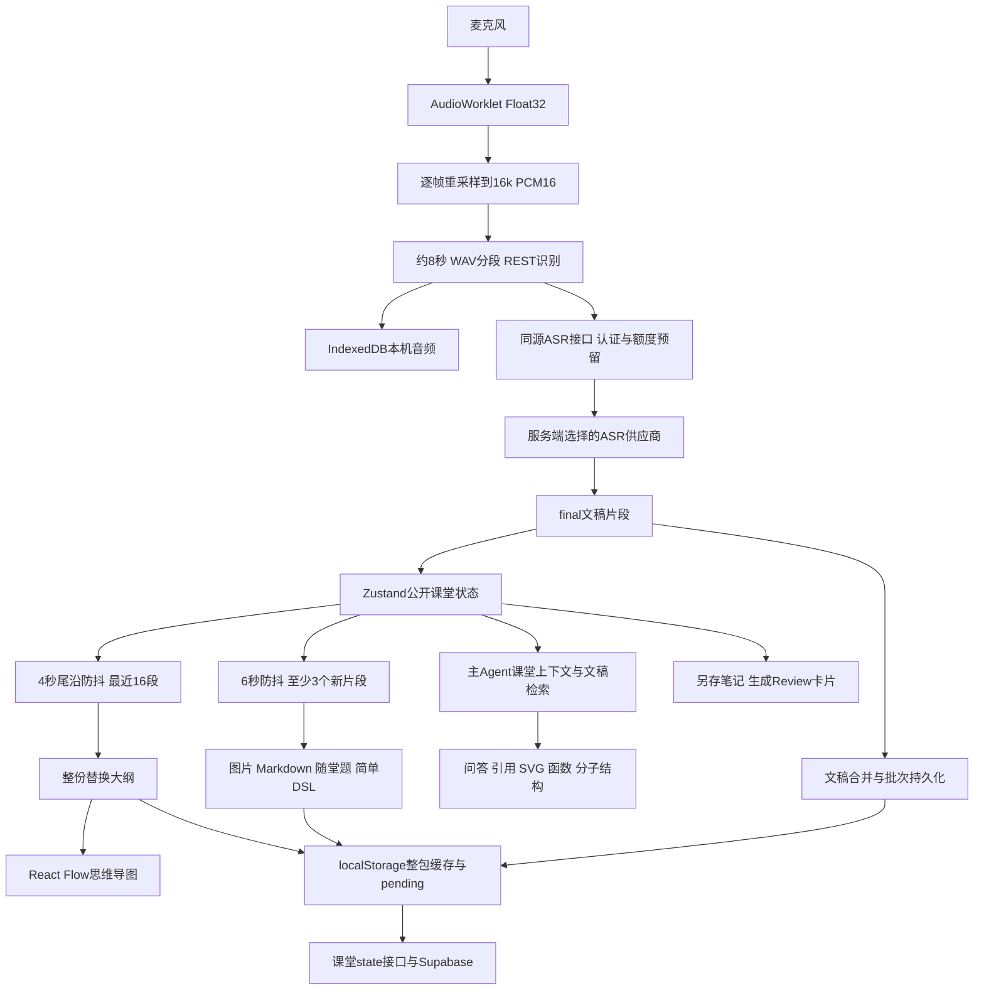
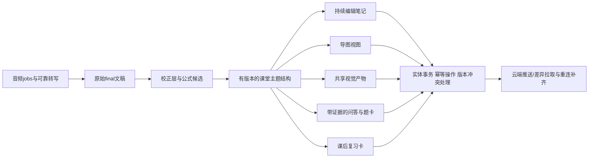

# Class 全链路审查与整合设计建议

> 这是修复前的审查快照，A编号和`probe-results.json`保留当时的反例证据。当前修复进度、正式回归与验收结果见[系统性执行计划](../../plans/2026-10-02-class-systematic-repair.md)。本目录的旧错误探针不作为修复后的通过门槛。

审查日期：2026-10-02（用户时区）。仓库：`1037Solo-StudySolo`；证据采集时 HEAD：`81df95b7`，结束时 HEAD：`3d2133fc`，同时审查本地工作区。开始时已有 Auth、Markdown、同步引擎等未提交修改；审查期间其他工作将这些改动提交。本次没有改动这些业务文件，也没有执行提交。核对两个 HEAD 之间的变更，Class 运行链路、课堂接口、共享画布和化学渲染器没有变化（仅课堂 OAuth 测试被另一项工作更新）；最终相关测试在更新后的工作区重跑通过。

本次新增内容仅为本报告、专用审查探针、配置与机器可读运行结果。报告中的“建议”均未实现，也未部署。

## 1. 核心判断

Class 已经具备真实录音、分段识别、AI 大纲、自动补充、主 Agent 问答、云端课堂数据和 Review 闪卡的基础。当前体验问题来自三方面：

1. **链路可靠性存在明确缺陷**：音频重采样、尾段持久化、本地缓存并发、导图层级与版本往返。
2. **课堂语义没有贯穿各功能**：学科、原始文稿、校正文稿、公式、导图节点、答案、视觉资料、笔记与闪卡缺少统一的来源和版本关系。
3. **布局按技术模块分区**：四个永久分屏外加课程列表和 Agent，学生需要在不同区域寻找同一个概念的内容；笔记编辑与课堂主流程分离。

优先修复会丢内容或改变内容结构的缺陷，再建设以“当前课堂主题”为中心的工作台。仅换颜色、调整分屏比例不能解决这些问题。

## 2. 审查范围与证据边界

已追踪以下实际代码路径：

- `ClassEntry → Workbench → TranscriptPane/NotesPane/RenderHost/StudioAgentPanel`。
- `capture/resample → pipeline → ASR factory → REST adapter → /api/class/asr/audio/transcriptions`。
- 热词预置、自定义热词、录音启动快照、600 字上下文转发。
- 大纲生成、树解析、React Flow/dagre、节点点击回跳、公开状态与云端接口。
- 静默 Agent 调度、工具调用、渲染消息、随堂题与图片卡。
- 主 Agent 课堂上下文、当前/过去课堂检索、引用、搜图和 SVG/分子/函数画布。
- 本地课堂缓存、pending 队列、服务端 owner 校验、SQL grants/RLS。
- 课堂转笔记、知识卡片生成、Review store，以及主题、宽度、滚动与手机入口。

`1037Solo-Classolo/` 是独立参考实现；当前运行入口使用根目录 `classolo/`。原工程的能力声明和历史验收记录不能自动证明当前集成版具有相同能力。尤其是 WS 适配器虽然存在，当前工厂强制返回 REST provider。

本次执行了类型检查、现有定向测试，以及不连接真实服务的 17 个缺陷探针。没有使用真实课堂录音、真实模型商或生产数据库；没有确认当前线上部署版本、上游 prompt 是否生效、真实识别准确率或已登录浏览器端完整体验。正式上线验收仍需真实音频和实际设备。

## 3. 当前链路



### 已确认的基础能力

- ASR 热词**确实接入请求链路**：`withHotwordPack` 合并预置与自定义词，adapter 构造 prompt，BFF 转发 prompt。不能将其描述为完全未接入。
- 主 Agent 的课堂检索会合并云端文稿与请求携带的实时尾部，减轻落库延迟对“刚才讲了什么”的影响。
- AI 请求已有服务端凭据、认证/MFA、额度预留和用量结算；已知上游拒绝与结果未知断连被区分处理。
- 大纲、渲染卡片、文稿有本地副本和云端保存入口；SQL 含显式 grants、RLS 与 owner 关联外键。
- 课堂 rich-text、题干与选项支持 KaTeX 排版；主 Agent 已有共享 SVG、函数图与 RDKit 分子画布。

以上是可复用资产，应以修复和整合为主。

## 4. 可复现缺陷清单

下表的 A01–A17 均通过本目录探针确认。探针断言的是**当前问题可以重现**；17 个探针通过不代表功能已修复。

| 编号 | 优先级 | 问题与后果 | 根因/代码位置 | 修复方向 |
|---|---|---|---|---|
| A01 | P1 | 48kHz、128 样本帧输入，1 秒只得到 15,750 个输出样本，目标应为 16,000；约 1.5625% 时基误差 | `classolo/features/transcript/resample.ts:14` 每帧独立 floor，丢余数、无跨帧相位 | 实现有状态重采样，保持剩余样本与分数相位；加适当低通滤波 |
| A02 | P1 | 已有写入进行时 `flush(true)` 立即返回 false，结束/切课未等待剩余文稿落稳 | `features/transcript/flush.ts:115` 用布尔锁直接跳过强制 flush | 共享在途 Promise；结束时 drain 到队列为空，再允许切课 |
| A03 | P1 | “10 秒落库”没有实际定时器；最后一段之后没有新 final，就可能一直留在内存 | `features/transcript/flush.ts:109` 只在调用 flush 时比较时间 | 安装独立周期/最老队列年龄 timer；页隐藏和结束有显式 drain |
| A04 | P1 | 每 3 秒来一个 final，1 分钟内大纲生成 0 次 | `features/notes/organizer.ts:152` 每次事件清空 4 秒尾沿 timer，缺少 maxWait | 使用最大等待时间的合并调度；单飞行、保留 dirty 版本，完成后追赶 |
| A05 | P1 | 长课堂大纲丢掉前文；新主题替换旧主题 | `organizer.ts:108,175` 只给最近16段，且没有前一份大纲/patch协议 | 将新 final 与已有稳定树作为输入，输出有版本的增量变更；课后全量归并 |
| A06 | P1 | 点击 AI 导图节点无法定位文稿 | `hierarchy.ts:20` 派生 `on-*` ID；`notes/jump.ts:3` 却把节点ID当segmentId | 节点独立ID，另外存 sourceSegmentIds；点击时选真实来源片段 |
| A07 | P1 | 云端 revision=41 的导图恢复成本地 revision=1 | `lib/session/writes/notes.ts:8` digest更改时忽略传入版本 | 独立 hydrate API，原样恢复服务端revision；新改动才递增 |
| A08 | P1 | 第一节课触发到20段后，第二节课要增长到23段才重新补充 | `features/agent/silent-machine.ts:93` 全局 lastFiredCount 没按session重置 | 状态以 owner/session 为作用域；切课重置计数并取消旧任务 |
| A09 | P1 | 无选项开放题只有题干，没有请求答案/讲解入口 | `render-modules/ai-ask/Component.tsx:45` 全部操作包在choices分支里 | 开放题、选择题均能获取答案；结果保存在题卡内 |
| A10 | P1 | 列表请求返回时覆盖请求期间已保存的本地文稿 | `lib/db/index.ts:71–72` await之前读cache，返回后保存旧整包 | 返回后重新读取/事务合并；更适合IndexedDB事务和实体级写入 |
| A11 | P1 | 失败ASR分段只报错，没有自动恢复该段转写 | `asr/transcriptions-rest/openai-compatible.ts:209–241` 先取走PCM，catch无任务队列 | 音频先持久化为job；明确失败可重试，结果未知须查状态；提供人工重转 |
| A12 | P1 | 云端导图保存丢失parentId，重新打开/跨设备树变成无连线节点 | `/api/class/state/route.ts:76` Zod对象未声明parentId，解析时剥离 | 共享有版本的节点schema，保存父子关系与来源；验证无环、孤儿等 |
| A13 | P1 | 新revision=41之后仍接受revision=1并覆盖 | `/api/class/state/route.ts:77` 无条件upsert，无CAS | 数据库原子比较expectedRevision；409冲突后合并，不能先读再写模拟CAS |
| A14 | P1 | 601字热词prompt被拒绝时已预留额度且没有取消；本次未调用供应商 | `/api/class/asr/.../route.ts:27–31` reserve在完整参数验证之前 | 所有输入验证先于reserve；未发送的失败释放预留 |
| A15 | P2 | 插入同级节点后可与已有节点坐标完全重合 | `mindmap/layout.ts:101–109` 新节点用新布局，旧节点强行保留旧坐标 | 子树布局/碰撞处理，或整次布局后平滑过渡；稳定ID不等于永久固定坐标 |
| A16 | P1 | 供应商慢时，下一分段积累61秒，WAV=1,952,044字节，超出BFF上限1,920,044 | REST adapter的chunks持续累积；inflight结束前不切出有界任务 | 采集和识别解耦，采集始终产生有界分段，队列负责背压和重放 |
| A17 | P1 | 短文稿合并保存后第二段ID消失；实时可点击的引用重开后失效 | `features/transcript/flush.ts:32` 合并内容却只保留第一段ID | 永久保留segment身份；显示合并不改变存储ID，或保存兼容映射 |

P1表示影响主要功能、内容完整性或计费，优先修复；P2表示交互/稳定性问题。这里未把未知线上事故推定为P0。

## 5. 录音与流式转文字深审

### 5.1 实际实时性

`REST_SLICE_MS=8000`，adapter能力标记是`streaming:'pseudo'`。所谓partial只是“准实时转写中…”状态文案，**不是逐字识别结果**。通常至少等待约8秒音频积累，再加网络和模型处理；导图再加4秒，补充再加6秒，排队和重试继续叠加。这是代码推导的时序，不是本次测得的线上延迟。

WS代码存在，但`createASRProvider`强制REST。想提供更快的课堂体验，应在服务端支持真实实时识别通道；浏览器不能获得供应商长期密钥。WebSocket桥接或短期受限token方案需结合实际部署平台验证，不能只把前端family切成`realtime-ws`。

### 5.2 分段与可靠性

当前固定8秒切片无VAD、无跨切片语境/重叠对齐，容易在专有名词、句子和口述公式中间切开。对于本次没有音频验证的这一风险，应以固定测试语料量化，不能宣称已造成某个百分比的识别下降。

建议处理顺序：

1. 采集连续音频并持久化；使用有状态重采样，记录真实时间基准。
2. 基于语音活动与最大时长产生有界job；必要时保留短重叠，按offset/文本对齐去重。
3. 每个job有`audioJobId, requestId, sessionId, sequence, startMs, endMs, state`；状态区分queued、inflight、succeeded、retryable、uncertain。
4. ASR可产生partial预览；只有final提交给下游整理，后续更正以revision传播。
5. 停止流程依次结束采集、封尾段、等ASR队列、drain文稿保存，最后标记课程ended。
6. 失败保留可回放音频并给出段级恢复入口；已知拒绝可以重试，供应商是否处理未知的请求先核对计费和状态。

当前本机音频IndexedDB是有价值的恢复基础，但没有完整转写任务索引/重放入口。导出只得到多个WAV的ZIP，没有课堂内可听回放、统一时轴、云端音频或跨设备续转。服务端ASR返回只有text，时戳是本地分段区间，不是词级/句级强制对齐。

### 5.3 生命周期额外风险（代码确认，未做设备实测）

- `startSession`在权限成功之前清空当前公开状态并标记recording；没有starting/stopping状态或重入锁。
- 麦克风拒绝时capture返回，provider已启动；ASR/session资源没有作为一个生命周期回滚。
- AudioContext/worklet初始化发生在getUserMedia后的另一段逻辑，异常清理不完整。
- 设备ended只stopCapture，未统一封ASR尾段、drain持久化及更新云端状态。
- 暂停只暂停采集与文稿flusher，没有立即封不足8秒的ASR尾段。
- `flush-runtime`的溢出缓存用setItem覆盖，后续失败批次可覆盖前批；未发现对应重放读取逻辑。存储失败被吞掉，用户无法确认哪几段可恢复。
- 本机音频长期积累但没有保留周期、空间上限和明确清理入口；整段原始PCM约32KB/s，1小时约115.2MB（十进制，不含索引开销）。

这些需要一个统一session runtime负责取消、封尾、恢复和状态，不应分散到多个React effect和模块全局变量。

## 6. 学科、热词与关键词纠错

### 6.1 当前能力的准确界定

当前只有“物理”（7词）和“医学”（6词）两个预置包，默认物理。没有语文、通用英语、数学、化学以及医学二级分类。包选择和自定义词使用未按owner/session分区的localStorage，切课/切账号会继承当前设备偏好。

热词prompt上限600字符，按预置→自定义顺序拼接，遇到第一个超预算词直接break；如果预置/前面的自定义过长，后续重要词被截掉，界面没有告诉用户哪些词实际启用。热词在start时冻结，录音中更改下次才生效。

**热词上下文偏置不等于关键词纠错系统。** 当前没有`rawText/correctedText/termChanges`双层模型、专业词候选、出处、用户修订、确认或撤回。也没有把修订传播给导图、答案、视觉资料和闪卡的机制。

官方Qwen3-ASR代码提供context、language和可选强制对齐接口，但不能据此推断任意第三方`/audio/transcriptions`端点接受相同参数；每个实际provider应独立标注并验收supportedHotwords/context/partial/timestamps。[Qwen官方实现](https://github.com/QwenLM/Qwen3-ASR/blob/main/qwen_asr/inference/qwen3_asr.py)

### 6.2 建议分类

将“课堂学科分类”与“已有教材目录”区分开，通过一张映射连接。现有`SUBJECT_REGISTRY`是教材学科的单一来源，不要为了录音下拉框复制一份同名教材表。未有教材的语文/英语课堂也应允许创建，不能要求先添加整套教材。

| 一级分类 | 二级学科示例 | 默认语境与能力 |
|---|---|---|
| 语言与文学 | 语文/中文文学、通用英语、学术英语、医学英语 | 原文/翻译区分、人名书名、发音同形词、英中混合术语 |
| 数学与统计 | 高等数学、线性代数、概率论、医学统计 | 公式候选、变量表、函数图、推导步骤 |
| 物理与工程 | 力学、电磁学、光学、电路 | 物理量与单位、示意图、量纲检查 |
| 化学与生命科学 | 有机化学、分析化学、生化、细胞生物学 | 化学方程式、SMILES分子结构、过程图 |
| 医学 | 解剖、组胚、生理、病理、药理、微生物/免疫、临床分科 | 解剖实体、缩写展开、组织/通路图、限定来源 |
| 人文与社会科学 | 历史、政治、哲学、法律、经济 | 人名年代、引文、时间线、论证与因果图 |
| 计算机与信息技术 | 编程、算法、数据库、计算机系统 | 中英缩写、代码、架构图、状态图 |
| 其他/跨学科 | 通用记录、自定义课程、跨学科课程 | 不默认物理词汇；允许选主学科+辅助学科 |

session持有`disciplineId/subdisciplineId/courseName/languages/materialSubjectId?`。该选择同时决定热词、转写后处理、AI回答语境、公式/视觉默认策略、笔记与闪卡归档。

### 6.3 纠错流程

每个final保留原文与音频引用。确定的格式规范化（标点、已确认缩写映射）与可能改变意义的术语纠错分开；后者返回候选而不是静默替换。单靠编辑距离不能自动把相似医学名词替换成另一疾病/药物；否定词、数值、剂量、单位必须原样保留并在有歧义时标记。

术语库以学科、子学科、课程资料为来源，记录中英文、别名、缩写、常见错听、出处和版本；当下主题相关词优先于整包词。用户可看“实际传入词列表/被截断列表”，并把本节课确认的词加入该课词库。

词库与校正算法验收应使用按学科分层的固定语料，报告中文CER、英文WER、关键术语准确率、数字/单位/否定词错误率，分别比较无热词、热词、纠错三条路径，不用一个“总体准确率”掩盖专业错误。

## 7. 可渲染并验证的公式

### 7.1 当前缺口

原始文稿`TranscriptPane`直接输出`segment.text`，没有Markdown/数学解析。AI补充、随堂题和选项走KaTeX，但没有从口述数学转换为结构化公式的管道，也没有验证状态。导图标题也是普通文本。

Class有独立Streamdown插件链，主笔记/Agent使用共享Markdown管线；后者显式载入mhchem，Class自身没有显式约定该扩展，不能依赖别处加载的偶然副作用。需要统一renderer adapter与能力清单，同时保留不同容器的安全和流式处理要求。

### 7.2 验证必须分层

“排版成功”“转写忠实”“数学成立”是三件不同的事：

| 层次 | 可验证什么 | 产品可显示什么 |
|---|---|---|
| 语法/排版 | KaTeX可解析、定界符闭合、宏在白名单、输出非错误占位 | “可渲染” |
| 原文一致性 | 来源音频/文稿对应，符号/上下标/数值与语境一致 | “已对照文稿”；人工确认后显示确认者 |
| 数学/学科检查 | 受限表达式等价、变量域、量纲、元素/电荷守恒等明确检查 | “通过某项检查”，列检查范围 |

KaTeX的`renderToString`可进行预渲染；`throwOnError:true`可拒绝无效/不支持的LaTeX。`trust:false`、宏展开和尺寸限制应显式约定。不能把一条任意定理仅因KaTeX没有报错就标成“数学验证通过”。[KaTeX API](https://katex.org/docs/api)、[配置项](https://katex.org/docs/options)

### 7.3 推荐对象与流程

```ts
type FormulaCandidate = {
  id: string;
  sourceSegmentIds: string[];
  sourceSpan?: { startMs: number; endMs: number };
  spokenText: string;
  latex: string;
  alternatives?: string[];
  variables?: { symbol: string; meaning?: string; unit?: string }[];
  renderCheck: { status: 'pending' | 'valid' | 'invalid'; reason?: string };
  semanticCheck: { status: 'unchecked' | 'ambiguous' | 'confirmed' | 'checked'; checks?: string[] };
  revision: number;
};
```

final → 检测口述公式 → 结构化候选 → 渲染校验 → 受限学科检查 → 展示来源与歧义 → 用户确认/修改。半截公式只显示候选/处理中，不反复渲染错误LaTeX；失败保留口述原文。

例子：“a加b的平方”可能指`a+b^2`或`(a+b)^2`，不应自动挑一个再写“已验证”。数学公式、化学方程式、分子结构分别用LaTeX、mhchem、SMILES。分子能被RDKit解析也只证明结构输入有效，不能证明老师实际讲的是那个分子。

验收语料至少覆盖分数、括号、根号、上下标、积分上下限、向量、矩阵、多行推导、中英混读、单位、化学反应式和有歧义的口述。任何排版/规范化都保留可回溯的原始表达。

## 8. 思维导图为何不能稳定实时同步

### 8.1 三种不同的“同步”

1. **文稿→当前页面导图**：受8秒REST final、4秒调度、模型耗时/排队影响；尾沿防抖没有最大等待，导图只看最近16段，缺增量树维护。A04不能理解为当前8秒固定切片必然永久饿死；它证明调度在final间隔小于4秒时没有上限保证。
2. **保存→重新打开**：parentId被云端schema剥离（A12），恢复版本被重置（A07），旧版本可覆盖新版本（A13），节点ID无法回跳（A06/A17）。
3. **设备A→已打开的设备B/另一标签页**：目前只有本地store订阅和10秒pending发送，没有课堂云端推送订阅、拉取差异或storage/BroadcastChannel同步。**定时发送pending不是实时接收云端更新。**

因此没有单个“React Flow刷新bug”能够解释或修好全部同步问题。

### 8.2 目标数据结构

节点使用稳定uuid，另存标题、parentId、类型（主题/定义/例子/公式/疑问）、sourceSegmentIds、firstSeen/finalized、sourceRevision、lastUpdated。节点标题修订或换父级时不改变实体ID。

增量返回`baseRevision,nextRevision,addNodes,updateNodes,moveNodes,archiveNodes`；服务端校验父节点存在、无环、ID唯一、来源属于同一课、节点数量与内容长度受限。学生手工写的节点不能被后台模型覆盖；建议区分AI草案与确认内容，并支持撤销。

调度读“已处理到哪一个final revision”，即使新的final持续到达也在maxWait后执行；单任务在途，dirty版本合并。慢请求返回后继续处理最新版本，旧session结果丢弃。AI失败显示更新时间、处理到的片段和重试入口，不能把启发式降级伪装成正常AI整理。

### 8.3 云同步与布局

版本比较必须在数据库原子执行；同账号不同设备需明确当前writer租约/冲突策略。原文append与导图patch使用operationKey落实幂等；现在接口接收operationKey但未消费它。

实时通道用于通知新revision；客户端读取或应用受限patch，并在重连时补差。若部署环境暂不能推送，可先采用只在页面可见时的版本poll，公开说明延迟；不能宣称已经实时同步。

布局避免混用新旧坐标；更新优先保持用户正在看的子树，仅在初次打开/主动点击“适应画布”时全图fit。现在每次signature改变都fitView，会打断放大阅读。React Flow允许控制viewport并提供fitBounds/fitView等接口，可复用而无需换绘图库。[React Flow组件](https://reactflow.dev/api-reference/react-flow)、[实例接口](https://reactflow.dev/api-reference/types/react-flow-instance)

## 9. 随时提问与答案闭环

主Agent和自动生成的“随堂提问”需要分别审查：前者能聊天答复，后者目前不是一个完整题目系统。

### 9.1 当前问题

- `ai-ask`schema只有question和可选choices，没有answer、answerIndex、explanation、evidence或attempt。
- 选择题把“我选A”发给右侧Agent，题卡仅显示asked；asked在发送时置true，没有等待模型成功。
- 开放题没有操作（A09）；没有“先提示/看答案/展开解析/追问”流程。
- 题卡请求未携带它自己的课堂session或明确题目证据；之后切课仍提交时，Agent依赖当时的活动课堂。
- 答案留在聊天历史，题卡本身不能在重开后恢复解释/答题进度；当前统一聊天体系是正确复用，但缺classSessionId/assessmentId关联。
- 静默任务计数跨课残留（A08），运行期间新一轮被running丢掉，已有计数却可能前进，没有待处理dirty任务回补。

### 9.2 建议行为

提问入口支持“解释这段”“老师刚才结论是什么”“画图说明”“给例子”“我哪里理解错了”。选中文稿/导图节点时附带session、来源片段和内容revision；界面显示这个问题在问哪一段。

随堂题有稳定assessmentId、题型、题干、选项、答案、解析、sourceSegmentIds和生成版本。可先隐藏答案，但数据必须保存。选择题提交后在卡片内显示答案与解释；开放题也能获取参考答案，允许“仅看提示”。证据不足时写明缺什么，不能靠一个答案索引伪造判分可靠性。

跟进聊天继续复用主Agent；从题卡打开时明确绑定该题和课堂，不能只塞一串普通文字。原题、答案、学生尝试、错误原因可转成Review闪卡。用户问“画图”时就地显示视觉说明并可存笔记，不让用户到多个区找结果。

## 10. 随时可视化：搜图、SVG、分子与函数

### 10.1 已有能力与断点

| 能力 | 主Agent | Class自动补充 | 结论 |
|---|---|---|---|
| 图片搜索 | `imageSearch`，受联网搜索开关及工具设置影响 | `render_image`→组件挂载→独立Class搜图接口 | 两条配置/响应/执行路径需统一 |
| SVG示意图 | drawDiagram指南→SvgDiagram→净化/健康检查画布 | 无独立SVG模块/工具 | 可复用共享Canvas |
| 函数图 | 共享plot/DiagramCanvas | gen-ui只有text/kpi/stack | 当前DSL不具备图形能力 |
| 分子结构 | SMILES→RDKit WASM→SVG，含输入错误提示 | 未接SMILES模块 | 复用现有MoleculeRenderer |
| 化学方程式 | 共享Markdown mhchem | Class插件链没有独立约定 | 统一声明与专项验证 |
| 公式推导 | Markdown及FormulaSteps等 | rich-text可排版，无转写/验证对象 | 补公式管道与来源 |

`drawDiagram`本身主要返回编写指南，模型后续输出才进入画布；不能把调用这个工具当作已经成功生成可见图。现有SVG净化、可见性检查、RDKit is_valid和错误边界值得保留，但都不保证学科事实正确。

### 10.2 搜图的具体问题

Class接口硬编码Unsplash，per_page=1，只返回small URL与alt；没有作者、来源链接、许可信息、候选列表或相关性复核。图片props只持query，组件每次挂载重新检索，产生新requestId：重新打开课堂可能再次计费，内容也可能变化。用户真正想要的是固定的课堂资料，不应靠UI生命周期决定检索行为。

图片被`object-cover`裁切且最多192px高，解剖图/流程图的图例与标注可能不可读。主Agent搜图虽有作者来源和教育query增强，但以像素面积选择图，不能证明医学资料的准确性；中文教学关键词的覆盖需实际测。

Unsplash是目前代码里的实际provider；它不能被当作完整的专业解剖/组织学/分子图库。建议优先检索已审核教材图片，其次接入适合学科且有来源的资料检索API，最后用SVG生成抽象示意。区分真实资料、AI示意与照片，结果必须显示来源。

API展示有署名要求，Class目前裁掉这些响应字段，应在provider共享结果模型保留作者及来源；作为学习资料采用时的download tracking也应统一处理。[Unsplash署名指南](https://help.unsplash.com/en/articles/2511315-guideline-attribution)、[下载事件指南](https://help.unsplash.com/en/articles/2511258-guideline-triggering-a-download)

### 10.3 目标视觉产物

统一VisualArtifact保存`id, kind, sourceSegmentIds, sourceRevision, source/provider/license?, content, renderValidation, userEdits`。渲染层复用Canvas，不再让图片查询在Component effect里执行。

按内容选择：

- 真实组织形态、解剖位置、实验器材：可溯源图片/资料。
- 调控、因果、空间关系、流程：受约束SVG、流程图或交互示意。
- 函数/分布/变量变化：已有函数绘图与数据图形。
- 分子结构：SMILES + RDKit；反应式：mhchem；大分子/通路不强行伪装成小分子。
- 文学与历史：原文对照、人物关系、时间线、论证图。

自动视觉说明应按主题变化/明确需要触发，且有开关、节流和可见状态；不在每个8秒片段都自动搜图。用户点“画图解释”时有更高优先级，成功产物固定保存并供笔记、导图和问答复用。

## 11. 笔记与知识卡片

### 11.1 当前笔记为何不舒适

`NotesPane`实际只有导图，没有可直接写作的课堂笔记文档。`存为笔记`每次生成一篇新的外部学习笔记，使用`createAndOpenNote(null,...)`：不归档到本课学科；课堂继续发展时已存笔记不更新。

导出提纲只按有无parentId加一层缩进，三层以上被压成两层；仅导出rich-text补充，图片、SVG、题目/答案等不进入笔记。文稿全部追加到末尾，缺少按主题组织、老师原话与AI扩展的区分，也无段级来源。

### 11.2 卡片风险

卡片生成只看最后20段，不是整节课；Workbench未传subjectId，落到`classroom`通用类，且卡片没有稳定session/segment出处。

停止时8秒timer启动于capture变stopped，此时ASR尾段和导图未必完成（ASR允许120秒超时）；“自动一次”标志在生成成功前写入，失败后不会自然再次自动尝试。卡片函数await模型后没有检查owner/session是否仍一致，跨课/切账号异步结果需要重新确认归属；本次未声称已验证跨账号落库事故。

建议课后生成基于明确finalized barrier和主题覆盖：等转写封尾/存储完成，再对全课分主题归并。使用任务状态queued/running/succeeded/failed及可重试标志，成功后才写自动完成标记。每张卡保留来源、真实学科、公式校验和生成版本。

### 11.3 目标笔记体验

本课持有一篇持续编辑的工作笔记：AI建议分段出现，学生可采纳、编辑、忽略、固定；固定内容不会被后续生成覆盖。导图是同一课堂知识结构的视图，不是唯一“笔记”。文稿、笔记、资料和问答共享来源选择。

课后“整理成复习笔记”生成一个可审阅版本，保留手写内容，按主题归并定义、公式、例子、误区、题目与资料。继续复用已有Milkdown和用户笔记store，但补稳定classSessionId→noteId关联及更新/另存的明确动作。

## 12. 前端信息架构与操作设计

### 12.1 当前分区问题

默认左侧课程库256px，右侧Agent至少320px，中间再横向50/50、纵向65/35，共四个常驻区域。以1024px窗口推算，扣除两栏剩余约448px，每个中间列约224px；这是宽度预算推导，不是本次截图测量。

`WorkbenchShell`按window.innerWidth<720判断窄屏，而不是看中间容器实际可用宽度。768px以下主Agent被`hidden md:block`永久隐藏，没有手机提问替代入口；同时课程库默认展开。单纯把四区改成纵向堆叠不能修好手机操作。

文稿每次新增/partial变更强制scrollIntoView，会打断回看；导图每次变更全图fit；用户在追赶后台，而非控制阅读。题卡与解释分离，图片在另一栏，导图节点定位又失效，认知负担由这些交互叠加而来。

### 12.2 推荐桌面结构

```text
┌────────────────────────── 全站导航 ──────────────────────────┐
│ 本节课 / 重命名  学科 > 子学科  录音与转写状态  本地/云端状态   │
├────────┬─────────────────────────────┬───────────────────────┤
│课堂库  │ 阅读与笔记工作区             │ 上下文助教             │
│可折叠  │ [课堂笔记] [原文稿] [导图]    │ 当前问题/当前概念       │
│按学科  │ [资料与可视化]               │ 答案/解析/追问          │
│按日期  │ 主题段落 + 公式 + 图片 + 批注 │ 本段引用与相关资料      │
│搜索    │ 点击来源可定位原文/音频      │ [解释] [画图] [搜资料]  │
├────────┴─────────────────────────────┴───────────────────────┤
│ 录音暂停/停止 · 当前时间 · 自动跟随开关 · 正在处理/未同步段数   │
└─────────────────────────────────────────────────────────────┘
```

这不是将所有能力隐藏到tab：默认课堂笔记/原文混合阅读，公式和视觉结果可嵌在对应概念旁；导图/原文tab提供更深层查看。需要同时对照时打开一个可关闭的“对照窗”，而非强制四个区长期平分空间。

推荐统一`ClassSelection`：sessionId、segmentIds、nodeId?、formulaId?、artifactId?、sourceRevision。点文稿、导图或笔记内容都更新相同选择；助教入口自然知道在解释什么。回跳时若原文在另一个tab，先切换tab并等待目标渲染，再滚动与高亮。

### 12.3 具体交互

1. 课前：填写课名/学科/语言，可附本课材料，显示启用热词与服务状态，再开始录音。
2. 课中：转写partial弱化显示，final变成主题段落；状态区展示转写到何时、导图更新到何段、保存是否完成。
3. 划选/点节点：浮层只有“解释、纠错、画图、记到笔记、出题”，支持键盘，不弹多层窗口。
4. 问题：右侧答案可附公式/图片/SVG，同一条结果能“插入当前笔记/关联导图节点”。题目本身就能展开答案。
5. 回看：离开底部自动解除跟随，显示“有N条新内容”；用户点后再追赶。AI生成不抢焦点/不移动视图。
6. 笔记：学生输入优先；自动建议明确标识，逐块采纳可撤销；避免后台覆盖用户内容。
7. 课后：先显示“正在完成尾段”再到“课堂结束”；生成可审阅的笔记与复习卡，不依赖8秒猜测。

### 12.4 手机与平板

手机采用单工作区，底部`笔记 / 文稿 / 导图 / 提问`，课程库和资料用sheet。录音控制保持可见，提问始终可达；收起键盘后回到原滚动位置。公式横向可滚动，图片可完整放大；导图支持聚焦当前主题、展开分支和适应画布。

平板/窄桌面基于容器宽度选择一主区+助教sheet；足够宽再启用助教常驻栏。菜单中容纳低频导出/设置，顶部保留课名、学科、录音和同步这些关键信息。

### 12.5 设计与性能

保留StudySolo语义色和主题体系；层级通过文字大小、间距、边框与少量状态色表达，降低四区框线密度。术语、公式、视觉说明采用同一概念卡样式，重要来源易见；密钥/技术内部字段不能出现在学生设置说明里。

长文稿/渲染列表采用虚拟化或分块，避免每次final重建所有段落。麦克风电平节流到约10–20Hz，不要把每个AudioWorklet帧都推进可见React状态（128帧、48kHz理论上375次/秒）；这是调用频率推导，需浏览器profiling确认实际渲染成本。

整包localStorage JSON读写会随所有课程内容增长阻塞主线程，建议实体级IndexedDB事务；后台AI用revision变化触发并合并，而非每次全量复制/发送。昂贵导图布局和分子WASM按视图需要加载；用户明确提问优先于后台补充，延迟任务可取消。

## 13. 目标架构与兼容迁移



建议演进对象：ClassSession、AudioJob、TranscriptSegment、Correction、FormulaCandidate、TopicNode、NoteDocument、VisualArtifact、Assessment、ReviewCardLink。稳定ID+sourceSegmentIds+sourceRevision贯穿全链路，不要求一次引入完整事件溯源框架。

先兼容已有`ss_class_*`表和数据：版本化payload/schema，增加缺失字段和原子revision RPC；旧导图parentId已被剥掉的数据无法凭空恢复，需要标记legacy并允许根据文稿重新生成；旧引用应保留旧segmentID映射。任何重建有可审阅输出，不覆盖学生手写内容。

课堂和主站有两套同步路径：前者localStorage pending→class/state，后者通用同步引擎处理笔记/卡片/聊天/产物。优先统一幂等、身份作用域和版本契约，再决定是否合并底层引擎；不能只把Class对象塞进现有engine却不解决双写与版本冲突。

云端所有写入维持canonical owner、MFA、权限与中央计费规则。课堂跨用户取消和数据读取保护继续保留；本次代码审查没有发现应废弃它们的理由。`service_role`路径必须持续显式owner过滤，RLS不是该路径的替代保护。

## 14. 修复与交付顺序

| 阶段 | 交付内容 | 退出条件 |
|---|---|---|
| R1 数据完整性 | parentId/版本恢复/CAS、cache事务、segment身份、尾段drain、音频有界队列、预留前验证 | A02/A03/A07/A10–A14/A16/A17改为期望行为回归测试并通过 |
| R2 课堂实时性 | 有状态重采样、语音分段、调度maxWait、增量主题树、跨课取消、云端更新接收 | 持续讲话/慢模型/断网/换设备仍可追赶，A01/A04–A08修复 |
| R3 教学能力 | 分层学科、课程词库、可回溯纠错、公式对象与检查、题卡内答案 | 每种题型和学科有可复现语料；清楚区分排版与语义确认 |
| R4 视觉与笔记闭环 | 复用Canvas/RDKit/搜图固定产物，来源可溯；持续笔记、全课卡片 | 重开不重复检索计费，产物/来源/答案可存笔记并恢复 |
| R5 前端整合 | 一个课堂工作区、明确selection、对照模式、手机提问、阅读跟随控制 | 实际桌面/手机完成下列验收，无内容/版本回归 |

为了较早改善体验，R1完成后可先交付课名/学科入口、开放题答案动作、手机Agent入口和回看跟随开关；大规模视觉重排应建立在可靠课堂数据之上。

## 15. 验收矩阵

| 范围 | 必测情境 | 验收要点 |
|---|---|---|
| 录音生命周期 | 拒绝权限、无设备、初始化失败、连点开始、暂停、停止中切课、设备断开、页隐藏 | 无残留麦克风/错误provider；尾段有明确结果；结束仅在drain后成功 |
| 重采样 | 48k/44.1k/16k输入，128帧及不规则帧，长音频、正弦/噪声 | 输出时间基准稳定；采样误差有界且不按帧累计 |
| 分段恢复 | 正常、供应商慢>60s、明确429、发送后断线、本地空间不足 | 分段不超上限；音频可定位恢复；未知请求不重复计费 |
| 术语与公式 | 各学科中英混读、缩写、同音术语、数字单位否定词、歧义公式 | 原文保留；校正可撤；渲染检查真实，歧义不假确认 |
| 导图增量 | 连续final无静默间隔、长课堂新旧主题、术语改名/节点移父/手改 | 有maxWait；全课结构不消失；学生内容不被覆盖 |
| 云端导图 | 本地→云端→重开→设备B、两端写同一revision、离线重连 | 父子/来源/版本一致；旧版本不能覆盖；冲突可恢复 |
| 引用 | 实时问答→保存→重开、短句、导图节点、跨课题目 | 每个引用都对应同一课真实segment/音频位置 |
| 问答与题卡 | 选择/开放/无证据/模型失败、切课后追问、查看旧题 | 卡内答案可得；失败可重试；题目课堂绑定正确 |
| 可视化 | 图片无结果/配置缺失/不相关、SVG空/恶意、非法SMILES、RDKit加载失败 | 明确状态；来源显示；安全渲染；已有产物重开不重复付费 |
| 笔记与卡片 | 手写与AI并发、整理全课、失败再试、重复保存、跨账号结束任务 | 保持手写；学科正确；来源稳定；全课覆盖；无错误归属 |
| 布局与可达性 | 390/768/1024/1440宽度、字体放大、软键盘、键盘/读屏 | 提问始终可达；公式可读；无强制抢滚动/视口；焦点和状态提示清楚 |
| 长课堂性能 | 60–120分钟合成final与数百节点/卡片 | 输入不卡顿；音频不丢；列表虚拟化/布局成本/主线程长任务实测 |

初始性能目标可设为真实实时provider的final提交后，主题/导图patch在约5秒内开始处理，并公开排队状态；具体P95/P99需在目标设备、部署区域与provider上测定。REST方案不能承诺从讲话开始1秒内出final。目标数值是验收提案，不是当前性能结果。

## 16. 本次验证结果与复现方法

| 验证 | 结果 |
|---|---|
| `npm run typecheck`（开始时及添加审查文件后） | 两次通过，退出码0 |
| 既有React定向测试：全部classolo/tests内React测试、ClassPlaceholder | 6文件，49测试通过 |
| 既有Node定向测试：owner、session-filter、silent-tools、class-tariffs、agentContext、searchClassTranscript/tool、drawDiagram/tool | 37测试通过 |
| 本报告独立探针 | 2文件，17探针通过；证明列明缺陷仍存在 |

专用探针使用合成owner、合成文稿、mock数据库和mock计费/模型，不读取凭据、不发送课堂内容、不修改远端数据库。文件后缀是`.probe.tsx`，由独立配置启动，不进入默认`*.test.tsx`产品测试集。

```powershell
npx vitest run --config docs/analysis/class-audit-2026-10-02/audit.config.ts
```

探针输出见[probe-results.json](./probe-results.json)，代码见[runtime.probe.tsx](./runtime.probe.tsx)和[server.probe.tsx](./server.probe.tsx)。修复时应把这些反例改为期望行为断言，纳入真实回归套件，不能把“已知bug断言通过”当作修复验收。

本次曾校正A15探针对dagre具体同级顺序的假设：最终断言“新节点与任一既有同级重合”，不依赖某个命名节点的排序。产品代码没有修改。

## 17. 需要实际环境补证的内容

- 当前线上是否部署本次审查的代码；配置状态是否只是变量齐全，还是服务实际健康。
- 当前ASR供应商和模型是否接受/利用600字prompt；不同学科热词增益多大。
- 真实课室远场、多人说话、噪声、教师口音、手机采集的准确率。
- 输入结束到final/导图/答案的真实延迟分布及模型并发限额。
- 目标部署平台的WS生命周期和计费能力；真实云端订阅/重连策略。
- 可视化来源的学科相关性、允许使用方式，以及实际医学组织图覆盖。
- 浏览器布局、手机软键盘、公式长式、持续录音和长课堂性能。

这些不影响本报告已复现的代码缺陷结论，但决定最终方案的provider选择和上线门槛。
