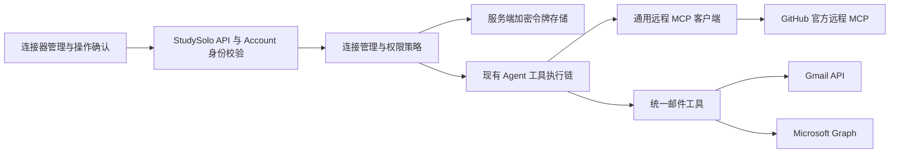

> **已归档：2026-10-04。** 早期选型分析，已被当前交接与代码参考取代。正文保留为历史快照，其中“完成/待办/已父验收”不得作为当前事实或派遣依据。当前入口：[完整交接](../../../handoff/studysolo-unattended-handoff.md)。

# StudySolo Agent 与常用连接器接入分析

日期：2026-10-03。依据当前工作区代码、相关测试、官方文档和 Chrome 控制台可见状态。本文是接入方案与申请进度，不是上线记录。

当前执行范围：用户已要求暂停 Microsoft，优先开通 GitHub 与 Google。最新外部状态见文末「实际开通结果」；前面的申请观察保留为分析阶段记录。

选型补充：Google 当前已提供官方 Workspace 远程 MCP（Developer Preview），另有申请资格、MCP API 开关及域/公司外公开使用限制；此前 API 适配器方案仍作为面向普通用户的稳定路径。新增 Notion / Todoist 与学习服务准备见 [学习连接器准备规格](../plans/2026-10-03-learning-connectors-preparation-spec.md)，不将文档选型或公开协议发现视作原生接入完成。

最新状态：开发凭证已准备完整；GitHub App 已安装，范围为所有仓库只读。实际 StudySolo 回调与工具适配器仍未实现，不代表应用内 MCP 调用已可用。

## 结论

StudySolo 的 Agent 已具备工具循环、上下文管理、来源与产物卡片、技能、用户确认和计费基础。插件市场目前主要是外部 MCP 配置目录；KitSolo 是已有未提交改动中的专用原生接入。GitHub、Gmail、Microsoft 邮箱尚未具备在本应用内授权后直接调用的完整链路。

建议先支持三个固定服务：GitHub 官方远程 MCP、Gmail API 适配器、Microsoft Graph 邮箱适配器。共享连接管理、令牌存储、权限策略和 Agent 桥接；邮件适配器以后可封装成独立 MCP 服务。任意第三方 MCP、桌面 stdio、服务端定时同步分阶段增加。

目前只有一位维护者，开发阶段可以由个人账号管理专用应用，不必为组织形式先购买套餐。但应用归属与可授权用户范围必须分开配置；个人持有的应用也能服务其他用户。生产配置、隐私审核与高校/企业管理员审批不会因此免除。

## 一、Agent 的当前结构

### 1. 产品入口

- `app/agent/layout.tsx` 复用 `AgentShell`；导航包含新对话、资产、定时任务、插件市场及项目/最近会话。
- `components/agent/AgentChatCenter.tsx` 组织回答、链接、图片、来源与产物；历史窗口外的信息可通过会话摘要补全。
- 会话和学习资产复用 Zustand 与 IndexedDB；不要为邮箱另建一套聊天持久化。

### 2. 执行链

`lib/hooks/useChat.ts` → `app/api/chat/route.ts` → `createStudyAgent` → `buildStudyTools` → 工具 execute → UIMessage stream → 结果卡与历史。

`app/api/chat/route.ts` 负责请求解析、身份/额度、模型选择、上下文压缩、流式生命周期、收尾续写及用量结算。新连接器应在这个已验证的服务端请求上下文内挂载，不接受请求 JSON 自报的用户 ID 或第三方 token。

`lib/ai/agent/studyAgent.ts` 使用 AI SDK 7 的 `ToolLoopAgent`。稳定提示词与工具顺序有利于缓存；位置、附件及计划模式等放在易变段。默认工具步数 6，可配置为 1–20。模型不支持工具时工具集为空；文本收尾续写关闭工具；生图模式只允许对应生图执行。

### 3. 工具与展示

当前 `STUDY_TOOL_NAMES` 包含 23 项：页面/大纲/节、笔记/闪卡/图片检索、网页与图片搜索、交互与图示、生图、测验、文档、产物读取、技能、记忆提案与确认写回、个人笔记候选修改、项目文件目录与切片、课堂文稿、KitSolo。

工具的服务端实现放在 `lib/ai/agent/tools/<name>/tool.ts`；类型与 presentation 可供客户端使用。登记点为 `names.ts`、`server.ts`、`presentations.ts` 与 `components/chat/toolCards/registry.tsx`。新工具还需双语 trace 文案。不得把服务端凭据、Node 模块或执行实现导出到客户端桶文件。

技能通过 `useSkill` 读取已导入的 Markdown，固定技能写入提示词。技能本身不提供 Gmail 或 GitHub 的网络执行能力。

### 4. 权限边界与调度

现有笔记与记忆流程提供了确认卡模式，可以借鉴来设计邮件发送、PR 创建等操作。连接器需要额外的服务端授权检查，不能靠模型承诺“只读”。

计划模式当前用 `PLAN_MODE_WRITE_TOOL_SET` 摘除内置写工具。KitSolo 的统一桥接名称不在该集合中；对第三方工具必须按具体远端操作判断读写。未来的通用桥接若只有一个 `call` 工具，仍需在执行入口阻止写操作。

`SchedulerRuntime.tsx` 是前台运行时：页面隐藏时不派发，关闭页面后不会继续执行，旧运行通过 stale 检查收口。不能据此承诺全天候收件箱监控。服务端调度需要另做持久队列、租约、重试、通知和授权过期管理。

## 二、连接器当前具备与缺少的部分

| 层 | 当前代码 | 现状 |
|---|---|---|
| 市场目录 | `public/plugins/market.json`、`lib/plugins/market.ts` | MCP / CLI / Skills；静态文件、搜索、双语资料 |
| 配置 UI | `McpConfigPanel.tsx` | env 填写、JSON 预览、复制给外部宿主 |
| 本地凭证 | `lib/stores/pluginSecrets.ts` | localStorage 轻混淆，并非加密 |
| 原生关联 | `/api/kitsolo/connect/`、callback、status | KitSolo 专用 OAuth 与关联提示 |
| 原生执行 | `kitsolo-rpc.ts`、`kitSolo/tool.ts` | 固定 KitSolo 服务的 initialize / initialized / tools/call |
| 第三方连接账户 | 无通用实现 | 缺持久授权、刷新、撤销、多账号管理 |
| 第三方 MCP 客户端 | 无通用实现 | 缺动态发现、SSE 响应、会话与连接生命周期 |
| 第三方操作审批 | 无通用实现 | 缺操作参数绑定、幂等确认与执行审计 |
| 邮箱适配器 | 未发现 | Gmail / Graph 工具需实现 |

具体发现：

1. 当前 GitHub 市场条目仍指向 `@modelcontextprotocol/server-github` 和旧 reference-server 目录。该实现已归档，正式方案应迁移至 GitHub 维护的官方服务；旧宿主导出流程需要兼容说明。
2. `buildMcpServerConfig` 对远程连接直接将 env 名用作 header 名，没有凭据到 `Authorization: Bearer ...` 的独立映射模型。它适合当前配置导出，不能直接作为通用授权客户端。
3. `pluginSecrets` 使用统一 localStorage key，当前该存储层没有看到按 Account UUID 分区的机制。邮箱 refresh token 不得存入这里，也不得同步进聊天记录。
4. KitSolo OAuth 客户端使用 state 与 S256 PKCE，回调仅设置 HttpOnly 安装提示；原生调用再通过 Account 身份及 KitSolo 已有同意记录获取专用短期 token。这个内部交换是生态特例，Google、Microsoft、GitHub 不提供相同接口。
5. KitSolo RPC 固定工具名前缀、协议版本和 JSON 响应；没有作为通用客户端处理远端 SSE 或持久 MCP session。其响应大小检查发生在读完整个响应之后，通用实现应改为流式字节上限。
6. KitSolo 镜像源由兄弟仓库的 `integrations/` 和同步脚本维护，实施时应在源处改动再同步，避免直接手改镜像漂移。

## 三、建议架构



这是建议的增量方案，不是代码现状。首版后端可留在 StudySolo Next 服务中，减少额外部署。若未来 Platform / StudyFlow 共用授权，迁移至生态连接服务；届时先定义信任与共享契约，不以跨域 Cookie 或第三方 token 透传代替授权。

### 1. 服务注册表与接口

建议新增 `lib/connectors/`：

- `registry.ts`：provider ID、传输方式、固定 endpoint、OAuth 配置、允许的 scope、工具映射与读写策略。
- `oauth/`：授权启动、回调、state / PKCE、当前用户绑定、增量授权。
- `repository.ts`：连接元数据与 token 记录的事务操作。
- `tokenVault.ts`：AEAD 加密、key version、解密权限、轮换。
- `mcp/`：HTTP 协议、初始化、工具发现与校验、会话清理、超时、响应上限。
- `providers/github.ts`、`googleMail.ts`、`microsoftMail.ts`：服务适配器。
- `policy.ts`、`pendingActions.ts`：只读模式、操作确认、执行幂等与审计。

建议 API 合同：

| 路由 | 方法与职责 |
|---|---|
| `/api/connectors/` | GET，只返回当前用户的连接状态和非敏感元数据 |
| `/api/connectors/[provider]/start/` | POST，同源校验后创建 OAuth transaction，返回授权入口 |
| `/api/connectors/[provider]/callback/` | GET，校验 state、用户绑定、有效期后服务端兑换 |
| `/api/connectors/[connectionId]/disconnect/` | POST，立即禁用本地连接并尝试撤销提供商授权 |
| `/api/connectors/actions/[actionId]/confirm/` | POST，确认既定操作，不接受重新替换的目标或参数 |
| `/api/connectors/actions/[actionId]/cancel/` | POST，取消候选操作 |

上述路由尚未实现。浏览器注册的回调草稿是规划地址，不能据此声称 OAuth 闭环已完成。

### 2. 数据合同

建议连接元数据包含 `id / owner_uuid / provider / provider_account_id / tenant_id / granted_scopes / status / created_at / updated_at / revoked_at / version`。

支持一个用户连接多个邮箱；唯一约束应考虑 `(owner_uuid, provider, provider_account_id, tenant_id)`，不得只限制“一人一个 Google”。用户邮箱可作为 UI 说明，但归属主键使用 Account UUID，不能用可变邮箱合并用户。

token 存储与前端可查询元数据分离，只允许服务端访问。AEAD 的附加认证数据绑定 owner、连接、provider 和 key version。刷新采用每连接互斥与数据库 CAS，防止并发刷新覆盖新 refresh token；保留旧版本到新记录提交成功。`invalid_grant` 转为需要重新关联，UI 不显示 token。

如果采用 Supabase 共享存储，新共享迁移应在 `1037Solo-Shared/supabase/migrations/` 唯一维护，先核实现有 schema，元数据启用 RLS、token 表不给客户端读取权限。本文没有创建数据库表或修改迁移。

### 3. MCP 运行时

使用符合官方协议的客户端，支持资源和授权服务器发现、精确 callback、token audience / resource 校验，以及提供商实际支持的认证方式。Account 用户 token 不发送到第三方 MCP；提供商 token 只用于对应服务。

固定服务 endpoint 是首版范围。后来开放任意 URL 时，增加 SSRF 防护：DNS/重定向复查、私网/loopback/link-local 拦截、TLS、端口限制。第三方 OAuth discovery URL 同样需要出口策略。

工具 schema 在发现阶段校验，工具名加连接命名空间。工具集按任务相关性、用户开关和授权过滤，避免每次把全部 GitHub / 邮件能力写入提示词。可提供发现工具和只读调用桥，但执行入口仍要校验允许工具和参数 schema。

客户端复用按 owner / connection / credential version 隔离；不缓存全局唯一的用户凭证。设 TTL、最大数量和并发额度，撤销/退出时释放会话。首版没有必要为远程工具启动常驻本地进程。

### 4. 外部写入确认

邮件发送、修改标签、删除、GitHub 提交/PR 等应以候选操作卡呈现。用户确认后，服务器重新确认 UUID、连接、scope、参数摘要、有效期及操作状态。action ID 只允许执行一次，不能用模型生成的 `confirmed: true` 绕过。

发送超时可能已成功，不能盲目自动重试。记录 `unknown` 并查询或要求用户处理；邮件或 GitHub API 没有适用幂等能力时，明确保留这个不确定状态。

## 四、三类服务的接入

### GitHub

推荐官方远程 endpoint `https://api.githubcopilot.com/mcp/`。注册专用 GitHub App，用用户授权 token 代表各自用户；初始限定仓库选择及 Contents、Issues、Pull requests 读取。写权限按真实功能再增加。启用工具只读策略，即使 token 权限更宽也不自动开放写工具。

GitHub 的远程 MCP 没有动态客户端注册；宿主需要自己的应用登记。应用可由个人或组织持有，GitHub App 后续可转移所有权。开发 PAT 仅作为有限范围联调方案，不能把维护者 PAT 作为全体用户凭证。

依据：[官方 MCP](https://github.com/github/github-mcp-server)、[宿主指南](https://github.com/github/github-mcp-server/blob/main/docs/host-integration.md)、[旧 reference server 归档](https://github.com/modelcontextprotocol/servers)、[应用转交](https://docs.github.com/en/apps/maintaining-github-apps/transferring-ownership-of-a-github-app)。

### Google 邮箱

通过 Gmail API 覆盖个人 Gmail 与已启用 Gmail 的 Workspace 邮箱，包括自定义域名。不能仅看邮箱后缀判断提供商。

初始工具：`searchMessages / getMessage / listThreads / getAttachment`。先申请 `gmail.readonly`；发送能力单独增加 `gmail.send`。服务端持久草稿和标签/已读等修改要核对 `gmail.compose` / `gmail.modify`，不能宣称 readonly 支持写入。`gmail.metadata` 不支持正文读取，且 messages.list 的 `q` 不可用，不适合作为完整搜索替代。

OAuth 客户端采用服务端 Web 类型。开发与生产应隔离，Google 登录与 Gmail 连接也使用独立客户端；生产最好独立项目，防止连接器审核与登录应用耦合。配置品牌、域名、隐私页、数据使用/删除说明、External 受众、测试用户、Gmail API 及最小权限。

Gmail 的读取权限属于受限范围。正式面向公众且经服务器存储或传输相关数据时，应评估官方验证与安全评估要求。开发 Testing 模式有测试用户限制，邮箱授权的 refresh token 通常 7 天到期；不是长期生产方案。AI 处理邮件的数据去向与用途必须纳入 Google 数据政策评估。

依据：[权限](https://developers.google.com/workspace/gmail/api/auth/scopes)、[OAuth 生命周期](https://developers.google.com/identity/protocols/oauth2)、[验证](https://developers.google.com/identity/protocols/oauth2/production-readiness/restricted-scope-verification)、[搜索 API](https://developers.google.com/workspace/gmail/api/reference/rest/v1/users.messages/list)、[数据政策](https://developers.google.com/workspace/workspace-api-user-data-developer-policy)。

### Microsoft 邮箱

使用 Microsoft Graph。注册支持 `AzureADandPersonalMicrosoftAccount` 的应用，覆盖 Outlook.com / Hotmail / Live 与具备相应云邮箱的 Microsoft 365 工作/学校账号。使用 delegated 权限，初始 `Mail.Read`，必要的身份权限及 `offline_access`；起草增量 `Mail.ReadWrite`，发送增量 `Mail.Send`。不要为普通用户邮箱连接申请全租户 Application 邮件权限。

多租户账号登录配置不代表每个高校/企业都允许授权。需识别租户禁用用户同意、管理员审批、未验证发布者、条件访问、无邮箱许可等错误。共享邮箱需独立考虑 `.Shared` 权限和已有委托，不能以普通 Mail.Read 宣称完全覆盖。纯本地 Exchange 与归档邮箱不作为首版承诺。

应用注册归属 Entra 目录；个人登录账号、目录、应用受众、发布者验证是四个不同概念。登录后先检查可管理目录。官方当前对额外 Workforce tenant 的创建有订阅条件，不能承诺所有个人账号都能免费直接新建。应用对象不能直接跨租户移动，因此优先选择由自己长期控制的目录。

依据：[账号类型](https://learn.microsoft.com/en-us/entra/identity-platform/howto-modify-supported-accounts)、[Graph 权限](https://learn.microsoft.com/en-us/graph/permissions-reference)、[邮件覆盖](https://learn.microsoft.com/en-us/graph/outlook-mail-concept-overview)、[注册](https://learn.microsoft.com/en-us/entra/identity-platform/quickstart-register-app?tabs=client-secret)、[发布者验证](https://learn.microsoft.com/en-us/entra/identity-platform/publisher-verification-overview)、[创建目录](https://learn.microsoft.com/en-us/azure/active-directory/sign-up-organization)。

## 五、个人与组织归属的选择

| 服务 | 当前推荐 | 后续团队化路径 | 无法绕过的门槛 |
|---|---|---|---|
| GitHub | 个人持有专用 App，或已有免费组织持有 | 转交 App、配置 App 管理员 | 用户/组织的安装批准与仓库权限 |
| Google | 个人管理专用开发项目，生产隔离 | IAM 添加管理员、需要时迁移组织 | Gmail 审核、域名与数据政策 |
| Microsoft | 先检查自己控制的现有 Entra 目录 | 在同一目录增加管理员/所有者 | 目录创建条件、企业用户审批与发布者资格 |

GitHub Free 组织不等于 GitHub Team 付费套餐。Google Cloud Identity 有免费版，但组织配置仍涉及身份和域名；已有项目加入组织会继承相关策略。Microsoft 不能把“个人应用未来直接搬到公司租户”当作无成本路径，应提前选择归属。

依据：[GitHub 套餐](https://docs.github.com/en/get-started/learning-about-github/githubs-plans)、[Cloud Identity](https://cloud.google.com/identity/docs/editions)、[Google 项目迁移](https://docs.cloud.google.com/resource-manager/docs/project-migration)。

## 六、实施顺序与验收

1. 固定服务目录与连接 UI：明确外部宿主配置、未关联、已关联、需重新登录、权限不足、不可用。保留现有 KitSolo 改动。
2. 实现连接数据、服务端 vault、OAuth transaction、撤销及多账号选择；先以合成账号验证隔离和刷新竞争。
3. GitHub 官方 MCP：完成发现、授权、只读 tools/list / tools/call、取消和输出上限。
4. Gmail 与 Graph：完成读取、搜索、分页、线程/MIME、附件大小/类型限制及正文清洗。返回引用定位和明确错误。
5. Agent 桥接与操作卡：按授权暴露工具，接入现有消息流与用量链；完成计划模式与 scheduled 模式约束。
6. 增量写权限与审核材料：真实需求驱动，确认卡绑定参数，解决不确定发送结果。
7. 独立部署与生产验证；需要全天候监控时才扩展服务端调度。生产操作前必读生态 `OPS.md`，本报告没有执行发布。

验收要求：

- 用户 A 无法列出、选中、刷新或调用用户 B 的连接；回调期间切换账号不能把授权绑错。
- 取消授权、错误 state、重复回调、过期 code、callback 不匹配均拒绝；授权记录不能由用户自报覆盖。
- 并发刷新、轮换、断连与在途请求有确定处理；token 不出现在前端、日志、流、prompt、错误或历史中。
- 计划模式与未授权 scope 下的写操作由服务器拒绝；发送确认不能重放或换参。
- 401 / 403 / 429 / 5xx、超时、SSE、分页、超大正文/附件、HTML 邮件及恶意工具描述有对应测试。
- 真实账号闭环至少分别覆盖 GitHub 仓库、个人 Gmail、个人 Outlook；Workspace 与高校/企业 M365 的实际验收另行记录。
- 浏览器授权成功、应用注册成功、模拟工具通过、真实 API 成功和生产部署成功分别记录，不能互相替代。

## 七、本轮证据与申请进度

已运行：

```powershell
node --import tsx --test lib/plugins/market.test.ts lib/ai/agent/tools/kitSolo/tool.test.ts lib/ai/agent/studyAgent.test.ts lib/ai/agent/planMode.test.ts
```

28 项通过，0 失败。覆盖市场归一化/导出、Agent 工具循环/模式约束和 KitSolo mock MCP 调用与流；不代表第三方接入或生产可用。未改业务代码，未执行完整构建或全仓测试。

Chrome 实际观察：

- GitHub 当前个人账号没有已登记的 GitHub App；OAuth Apps 下已有 `RootSolo` 登录应用。用户已自行完成 Passkey/二次验证。准备了 `1037Solo Connectors Dev` 草稿：本地开发 callback，Contents / Issues / Pull requests 与必要 Metadata 只读，用户 token 过期/刷新开启，安装时请求用户 OAuth，关闭 Webhook，安装范围仅当前账号。未点击 Create，尚未安装或生成仓库访问 token。
- Google Cloud 项目 `StudySolo`（项目 ID `studysolo`）已有 `RootSolo` Web OAuth 客户端。Audience 为 External / Testing，显示没有测试用户；Data Access 没有配置 scope 条目。这只描述控制台可见配置，不能推断代码登录请求从未请求 OIDC scope。
- 已准备 `1037Solo Connectors Dev Web` 草稿：Web application，回调 `http://localhost:35349/api/connectors/google/callback/`，勾选 AI-powered agent。未提交 Create、未生成凭证、未添加 Gmail scope、未改变 RootSolo 客户端。这个草稿可用于已有项目的开发，但生产建议隔离项目。
- Microsoft 个人账号已登录，Entra 显示用户不存在于 `Microsoft Services` tenant，无法访问管理应用。官方故障文档明确描述个人账号直接进入管理中心时可能落入该默认目录；当前观察不能证明账号在其他目录的全部成员关系。已打开 Azure 官方免费账号开通表单，处于 Profile information 第一步，等待用户自行完成真实所在地、身份及可能的银行卡验证。表单默认地区为 United States，未代替用户确认或修改。没有创建订阅、目录或 Microsoft 应用。

Microsoft 错误依据：[官方 AADSTS50020 故障说明](https://learn.microsoft.com/troubleshoot/azure/active-directory/error-code-aadsts50020-user-account-identity-provider-does-not-exist)。原页面没有展示数字错误码，本文只将症状与官方场景对应，不声明已读取到该数字码。

草稿截图在 `artifacts/connector-analysis-2026-10-03/`。GitHub / Google 两个创建动作已合并发起具体提交确认，等待用户回复；Azure 注册由用户自行完成。

创建凭证或实际授予敏感数据访问需要在具体提交时按浏览器确认规则处理；表单草稿准备与只读检查已完成。不能将目前状态汇报为“所有服务已完善”。

## 八、实际开通结果

用户确认优先开通 GitHub / Google 后，已实际提交并核验：

### GitHub

- 应用 `1037Solo Connectors Dev` 已注册成功，设置页明确显示 Registration successful。
- App ID：`5164325`；Client ID：`Iv23liTugZ9IrJan6OLc`。这两个是公开标识，不是密钥。
- 管理地址：<https://github.com/settings/apps/1037solo-connectors-dev>。
- 沿用已确认的 localhost callback、仓库只读权限、关闭 Webhook、仅当前账号可安装等开发配置。
- 用户已具体确认生成凭证。Client Secret 已生成，完整值仅保存在本机受限且 Git 忽略的凭证备份；格式验证通过。
- 私钥已在 GitHub 登记，公开指纹为 `SHA256:dan+oB5gdWYRSmH3ibtqWxlyHverhEF9MhsevFtQUpY=`，但 Chrome 下载返回 `ERR_BLOCKED_BY_CLIENT`，本机没有取得对应 PEM。浏览器工具拒绝访问 `chrome://downloads/`，理由为只允许 HTTP / HTTPS；没有使用其他浏览器、隐藏 API 或调试协议绕过。已交给用户在 GitHub 设置页自行生成并下载私钥。
- 后续用户在浏览器完成安装。现已核验 App 的 Installed 状态，installation ID 为 `167244785`；安装设置中的实际范围为 All repositories，权限仍是只读。没有由 Agent 修改这个安装范围。
- 安装完成后浏览器跳到尚未实现的本地 callback，出现 404。没有交换或保存该跳转中的授权码，也不在文档里记录授权码；这不是 GitHub 安装失败。GitHub 管理页已恢复并标记保留。

### Google

- 项目 `studysolo` 中的 `1037Solo Connectors Dev Web` 已注册，客户端列表可见，原 `RootSolo` 客户端保留。
- 新 Client ID：`671850803365-u44p69cjn7e6pv9a54iuealnruk6ljmc.apps.googleusercontent.com`。
- 创建弹窗明确显示 Enabled。已下载新客户端凭证，核对 Client ID、secret 存在和 callback 匹配；原下载文件已移入本机受限、Git 忽略的 `.local-archive/connectors-private/`，只允许当前 Windows 用户与 SYSTEM 访问。没有把 secret 写入本文、截图、聊天、公开日志或可提交文件。
- 已逐个启用并在 Enabled APIs & Services 总表核对 Gmail、Drive、Calendar、Docs、Sheets、Slides、People 七项 API。没有开通 Workspace 管理员能力或修改计费套餐。
- 应用仍为 External / Testing。用户具体确认后，五项范围 `gmail.readonly`、`gmail.send`、`drive.readonly`、`calendar.readonly`、`contacts.readonly` 已保存，控制台显示 Data access changes saved。当前登录账号已加入测试用户列表；没有在可提交材料中保存该账号的明文联系方式。
- API 开关与 OAuth 客户端登记不代表已经获得邮箱、网盘、日历或联系人授权；未进行任何数据读取或邮件发送。

### 暂停与后续

Microsoft 按用户要求暂停，不继续创建 Azure 账号、订阅、目录或应用。

回调路由与 Agent 适配器仍需按第三至六节实现；此次没有修改业务代码或进行生产发布。正式对外服务还需品牌/隐私材料与提供商审核；当前完成的是开发应用登记和 API 基础准备。

证据：`artifacts/connector-analysis-2026-10-03/` 下的 `github-app-created.jpg`、`google-client-created.jpg`、`google-apis-enabled.jpg`。`application-drafts.json` 已更新实际状态，不含任何 secret。

凭证备份目录还包含 `.env.connectors.local`，供后续接入实现使用；这个文件不由当前应用自动加载。Google / GitHub 的 secret 存在性、预期 Client ID、callback 和 Git 忽略状态已验证；Windows ACL 只允许当前用户与 SYSTEM。GitHub PEM 下载完成后，须验证私钥可解析、文件权限及对应公钥指纹，再标记凭证准备完整。

私钥交付检查：用户提供的 `github-app-private-key.pem` 初次只有 40 字节，为十六进制令牌，没有 PEM 头尾，Node `createPrivateKey` 拒绝解析。当时未输出文件内容或加载为私钥，限制访问并保留文件，提示用户下载真正 PEM，并将状态标记为缺少有效私钥。这个历史检查已由下述有效下载的验证结果更新。

后续复查 Downloads，发现真正下载文件 `1037solo-connectors-dev.2026-10-02.private-key.pem`，长度 1679 字节。RSA 2048 位解析、签名/验签通过，SPKI 公钥 SHA-256 指纹 `SHA256:3VZ6OgwBCHFaXtVIqNpbEgD9TYet5WOYnnbp+Twwas4=` 与 GitHub 登记列表一致。文件名中的 2026-10-02 是提供商使用的日期，不是本地执行日期。

已将旧 40 字节文件在同一受限目录中归档为 `github-app-private-key.invalid-token-2026-10-03.pem`，把有效下载文件复制到正式 `github-app-private-key.pem`；Downloads 原文件保留。三个文件均收紧 Windows ACL，正式私钥和归档均被 Git 忽略。凭证准备状态现在为完整，但 callback / Agent 接入仍待实现。

页面恢复说明：安装标签实际跳转到了 404 callback，部分临时设置页不再出现在标签清单。已恢复 GitHub private-key 设置页和 Google OAuth 客户端列表，并重新标记为保留；没有继续生成密钥、修改安装权限或执行授权码交换。

## 九、环境变量统一配置

用户已授权直接更新相关环境变量。应用级配置已写入实际 `.env.local`、`.env.production` 并同步受限备份：14 项连接器变量，包含服务端 Client ID / Secret、GitHub 私钥 base64 与文件回退路径、开发/生产回调 origin、生产开关和独立加密密钥。两个文件各有 58 项原配置，逐项比对均保留。没有改 Windows User / Machine 全局环境，也没有操作云端控制台环境；当前进程没有同名全局连接器变量覆盖文件。

新增 `lib/connectors/config.server.ts` 统一读取与验证；`/api/health/connectors` 只返回非敏感应用配置状态；`scripts/connectors/configure-env.mjs` 和 `check-env.ts` 提供可重复配置和校验。实际 Next 开发服务已返回 HTTP 200，两个提供商均 configured；GitHub App JWT 的 `GET /app` 真实核验返回 200。开发/生产密钥独立，重复配置不轮换；环境文件与备份均由 Git 忽略并限制 Windows 权限。

35 项相关测试、类型检查、针对新增代码的 ESLint、追踪文件秘密扫描和新增源文件扫描均通过。完整生产构建、生产部署、用户授权回调与 Agent 工具接通不在这些验证结果中。

当前生产开关保留 false，因为只登记了开发 callback。授权记录加密密钥已准备，但没有用户 token 持久存储实现；实际用户授权与 Agent 调用仍需接入，不能把 configured 与 connected 混用。变量合同、生效与生产准备说明见 [connector-environment.md](../refer/connector-environment.md)。
