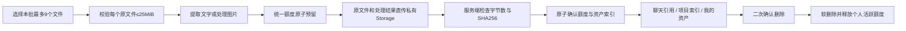

# StudySolo 云端文件与 Agent 上下文更新

日期：2026-10-08。范围来自本轮用户要求，与旧云沙箱/MCP续做队列分开。本轮不修改旧任务账本、不部署服务器、不触碰 VPN，也不提交无关反馈或课程内容。

后续用户已明确要求资产板块同步更新与子智能体深度审查；新资产聚合、详情、引用接续与审查修复见[我的资产审查更新](2026-10-08-assets-review-update.md)。本篇首轮验证计数保留为当轮证据，后续候选以新报告及当前源码为准。

## 当前交付状态

本机功能源码与相关回归已完成。2026-10-08用户明确授权使用父目录`.mcp.json`中的现有Supabase access token后，新增迁移已应用到准确RootSolo项目，正式历史为`202610080001 / user_cloud_files`。真实PostgREST列表GET返回200；RLS、服务角色RPC权限和私有bucket已核对。**正常登录账号的浏览器完整流程尚未验收，数据库就绪不等于正式网站全部功能验收。** 此前环境内管理凭据HTTP403属于已解决的迁移通道阻断；未绕登录、未新建应用/密钥、未更换数据库项目。

用户已确认统一 Supabase 与 Pro 年会员。本轮按该前提设计，但没有重新核对供应商账单。供应商 Pro 容量与产品每个用户的存储额度是两层合同；产品准入仍使用统一 `storage_apply` 与 `membership_plans`，没有新建一套定价或自行增加每个用户额度。

## 原机制的实际根因

| 链路 | 本轮读取到的问题 | 本次处理 |
| --- | --- | --- |
| 图片请求 | `requestBudget.ts` 写死 1 张、400KB；客户端和服务端都有同一限制 | 新原文件直传私有 Storage，聊天使用云引用；单次总计9个，原文件含照片每个25MiB |
| 文件处理 | 文档10MB、项目8MB；PDF/PPT为本机预览，不进入AI材料 | 共用25MiB原文件规则，文本/DOCX提取，PDF文本层/PPTX复用原解析器，图片自动缩放压缩；原文件不覆盖 |
| 云同步 | 附件只同步本机blob id；项目文件明确不上云 | 消息同步稳定cloudFileId；项目原文件和处理上下文入私有云，并可在另一设备重建索引缓存 |
| 请求减量 | 800KB后依次丢历史图片、项目正文、本轮图和较早消息 | 不再为传输成功静默丢这些内容；超过传输预算明确失败并保留原数据，执行路径先AI整理历史 |
| 手动压缩 | 截取前800字符，不调用AI，整段替换原消息 | 新受鉴权/计费的AI整理请求；保存contextCheckpoint，保留原始会话与最近6轮原文 |
| 自动压缩 | 服务端AI失败回退为前800字符，摘要只在进程缓存 | 失败明确保留原上下文；成功通过流事件保存检查点，并显示会话内进度 |
| 工具记忆 | 较早工具调用和结果在压缩前即被prune掉 | 保留工具结果至AI整理，摘要保留事实、约束、执行结果、文件标识与待办 |
| 项目工具接线 | request中有项目目录，但StudyAgent未向工具上下文透传 | 已接通目录/切片；readProjectSlices可按query/offset读取云端长文或处理后的图片 |

25MiB按`25 * 1024 * 1024`字节实现。图片2MiB常量是触发预处理的阈值，**不是原文件上传上限**。9个限制按每条用户消息/每批项目导入计算，不作为会话或项目累计文件上限；输入框引用文件与上传附件合计也在发送前和服务端校验。

## 文件与个人额度合同

- 数据库`ss_user_files`保存Account UUID、云文件ID、原文件/处理结果路径、大小、哈希、项目归属与pending/ready/deleted状态。
- 原文件与`context.json`构成一个文件包，**两者的字节都计入个人额度**。处理结果没有伪装成“免费容量”。
- 后端通过Account实时introspection认人；客户端提交的用户ID无效。新文件表不开放anon/authenticated直接访问，应用服务端限定owner。
- 上传链接只授权新建的固定对象，禁止覆盖。源文件不进入每次聊天POST，也不把service key放进浏览器。
- 确认上传时检查原文件和处理结果大小及SHA256。只有校验后才进入ready；重复确认/删除幂等。上传中断可在云文件页重试确认或取消未完成上传。
- 超额度由统一RPC原子拒绝，不依赖前端估算。错误引导到`/agent/assets?tab=cloud`，显示统一账户已用/预留/上限。
- 删除复用现有ConfirmDialog二次确认。数据库事务同时软删除文件、归档资产索引、释放个人额度；底层文件暂保留。本期没有物理清理或恢复UI，未来需要另定保留期/恢复/清理流程。
- 应用下载与模型读取每次检查owner与删除状态；软删除后的文件不能继续读取。对话遇到已删除引用时保留原文字并明确说明文件不可用，不让整段会话因此失效。

原文件与处理结果保留在供应商存储，所以软删除释放的是**产品个人活跃额度**，不是供应商实际占用字节。不能把这一动作写成“Supabase磁盘已释放”。

## 大文件与历史引用

新附件在本轮先给模型处理后的图片或文字前12000字符；更长正文继续存云端，并注明总长度/稳定ID，Agent可用既有readProjectSlices(query/offset)继续读取。目录会给出fileId与“云端全文可读”的说明，不把“没随POST携带”等同“没有文件”。

较早附件以稳定引用、名称及可读说明留在上下文中。需要具体文字或像素时由同一原生工具读取，**不要求用户再次上传**；因此不会在每轮把全部历史照片解码和大文件全文重新下载。正常上传后刷新/跨设备可从cloudFileId恢复附件与项目索引。

旧的仅本机附件不强制搬迁，不删除其blob。旧项目缓存与原文件也保留。重新导入同名文件失败会恢复先前索引，避免旧材料被error占位覆盖；成功的新版本在云端使用新的不可变引用，旧版仍可从资产管理。

PDF目前复用文本层解析，扫描件不会凭文件名编造正文；PPTX沿用原解析器，旧二进制PPT和未知格式保留现有兼容边界。本轮没有声称OCR、任意格式解析或所有第三方模型均支持图片。DOCX解压后的超大文本仍有处理安全边界，其限制与原文件25MiB不同。

## 上下文整理与持久性

手动入口（输入框压缩命令、TokenDashboard）调用`/api/context/compact`。整理请求走现有模型解析、统一钱包预留与usage ledger，不是字符串截断。

摘要保留用户目标、约束、事实、已做工作/证据、失败结果、未决问题、下一步与文件ID；最近6轮原文保留。`SessionMeta.contextCheckpoint`与会话元数据同步，**原始消息不被摘要替换或删除**。后续模型请求由检查点与尚未覆盖的原文组成；反复整理会把旧摘要与新增较早消息合并。

超过200条或达到软预算时客户端先整理，再重新估算；不会先截掉窗口外消息再让AI总结。服务端因实际上下文估算触发整理时也下发开始/完成事件，成功摘要回存同一会话。开始、完成、失败都在ChatThread内显示，错误/取消不伪装成功。

并发保护包括：同会话禁止同时整理，手动整理不与回答并发，AI返回后核对被覆盖源消息未变，切账号丢弃迟到检查点，编辑已覆盖的消息使检查点失效。项目索引切账号清空驻留内容时不写空快照覆盖下一个账号缓存。

## 本机验证

- 定向Node回归95项通过：文件合同、多次9附件、25MiB边界、云引用同步、请求压力不丢数据、AI失败不回退截取、原始会话保留、工具结果保留、请求schema与流事件、已有项目索引与存储原子性/owner epoch。
- React回归24项通过：附件输入、object URL释放、项目窗口、资产页、云文件删除确认、手动压缩成功/失败/账号切换、九张本轮照片进入模型参数且较早图片仍可按引用读取。
- 内存PostgreSQL使用实际统一foundation和新增SQL验证：额度溢出拒绝、跨owner操作拒绝、重复确认/删除不重复计账、软删除保留行、已删文件不能确认回ready、anon/authenticated访问拒绝、service_role无物理DELETE权限。它属于上述Node覆盖，**不是云端数据库验收**。
- 本机TypeScript检查通过；改动文件定向ESLint通过。ChatThread原有TanStack Virtual/React Compiler兼容提示仍为warning，未以重构掩盖。
- 仓库既有凭证扫描通过（2910个已追踪目标）；新文件另做扫描。本轮未改`.env`或Windows环境，没有打印密钥。
- 原有156个已脏文件只做哈希对照；期间观察到12个课程HTML变化，来源未核实，不归属本次文件机制修改，未覆盖/纳入交付。反馈候选和旧账本保留。

证据在`.local-archive/cloud-files-context-20261008/`。未执行会重生成课程manifest的整仓prebuild，也未把构建或mock冒充正常用户浏览器验收。

## 云端待接续项

1. 已使用用户指定的父目录MCP管理token核对准确RootSolo项目、统一RPC和原迁移历史。没有重放旧迁移。
2. 已应用`supabase/migrations/202610080001_user_cloud_files.sql`，在同一事务登记正式迁移历史并通知schema cache刷新。源SQL SHA256为`704e923608932a4af2e8463be488a1a9e945748e201df7b1f99ebcfd12a2e265`。bucket私有、上限33554432字节；RLS启用，anon/authenticated无直接读表及RPC执行权限，service_role可执行两个RPC且无表DELETE权限。脚本`--parent-mcp`只在进程中使用授权token，不输出或写入凭据。
3. 本机正常登录账号做一批9个混合附件、下一批附件、25MiB照片/文件、超个人额度拦截、资产下载与确认软删除、刷新/另一设备恢复、项目长文按需读取、真实AI压缩与续问；取消压缩时确认原文保留。
4. 再做正式候选CI与独立提交/同步。当前旧分支不整支合入，部署继续由用户负责。

尚未完成的是正常账号完整真实流程与正式网站运行验收。数据库迁移与源码发布分别记录，不把任一环节冒充整条链已验收。

## 官方技术依据

- [Supabase标准上传](https://supabase.com/docs/guides/storage/uploads/standard-uploads)：原文件可以直传Storage；官方对大于6MB推荐TUS提升可靠性。本期使用已支持的签名标准上传和失败确认恢复，没有声称断点续传已实现。
- [Storage上传大小限制](https://supabase.com/docs/guides/storage/uploads/file-limits)：供应商全局限制和bucket限制需同时满足；本项目的25MiB业务限制独立执行。
- [私有bucket与访问控制](https://supabase.com/docs/guides/storage/buckets/fundamentals)、[Storage RLS](https://supabase.com/docs/guides/storage/security/access-control)：本期私有对象由受鉴权服务端下载，不对外公开原文件，也不把短期下载链接长期写进模型历史。
